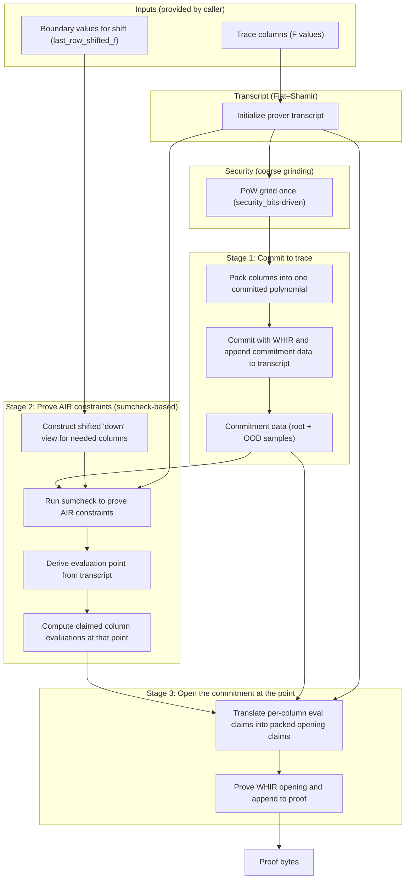
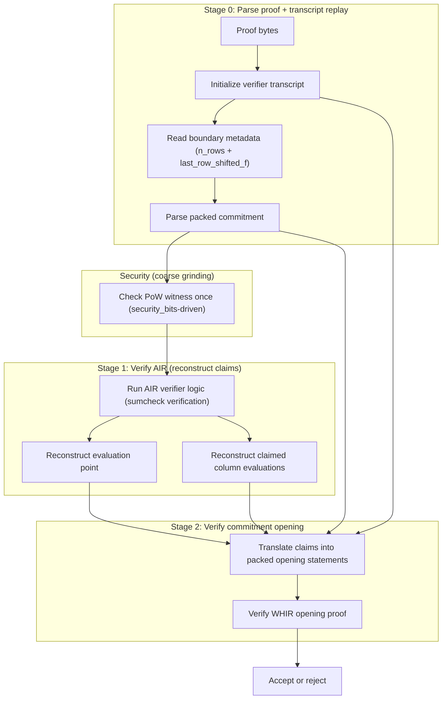
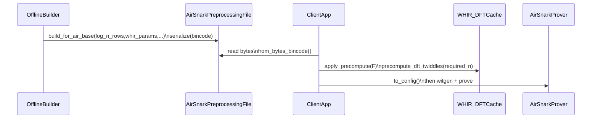

## AirSnark architecture (leanMultisig)

This document describes the **control flow** of `air_snark`: a single-AIR SNARK wrapper that uses:

- **AIR argument**: `air::prove_air` / `air::verify_air` (multilinear/sumcheck-based AIR argument)
- **PCS**: WHIR via `sub_protocols::packed_pcs_*` and `whir_p3::WhirConfig`
- **Transcript**: Fiat–Shamir `ProverState` / `VerifierState` (re-exported via `air_snark`)

The current `air_snark` implementation is **base-field trace only** (`columns_f`), but uses an extension field `EF`
for Fiat–Shamir challenges and sumcheck arithmetic (soundness).

### Modules and key entrypoints

- **High-level SNARK wrapper**
  - `crates/air_snark/src/lib.rs`
    - `prove_single_air_with_whir_base`
    - `verify_single_air_with_whir_base`

- **AIR argument (constraint proof)**
  - `crates/air/src/prove.rs`: `prove_air`
  - `crates/air/src/verify.rs`: `verify_air`

- **PCS adapter (pack many columns → commit/open once)**
  - `crates/sub_protocols/src/packed_pcs.rs`
    - `packed_pcs_commit`
    - `packed_pcs_parse_commitment`
    - `packed_pcs_global_statements_for_prover`
    - `packed_pcs_global_statements_for_verifier`

- **WHIR PCS**
  - `whir_p3::WhirConfig::{commit, prove, verify}`

- **Preprocessing artifact**
  - `crates/air_snark/src/preprocessing.rs`: `AirSnarkPreprocessing`
  - Trace layout: `AirSnarkTraceLayout` (dims + optional public-prefix data)

### High-level data model

- **Trace columns**: `columns_f: Vec<&[F]>` with length \(N = 2^{log_n_rows}\)
- **Trace layout**: `AirSnarkTraceLayout`
  - `dims_f[i]` is a `ColDims` describing how column `i` is packed and committed.
  - This scoped version supports **public-prefix columns** (lean-style) but **does not support fully-public columns**
    because we do not modify upstream `packed_pcs` behavior.
- **Transition access**: AIR needs `up` at row \(r\) and `down` at row \(r+1\)
  - `air::prove_air` constructs **shifted columns** for “down” using `down_column_indexes_f()` and `last_row_shifted_f`
  - This is the Whirlaway-style “up/down oracle” approach implemented with explicit shifting.

### Prover control flow

The flowcharts below are **conceptual**: boxes group operations and data dependencies, not concurrency. The real code runs
these stages **sequentially**.

#### Notes on the prover steps

- **Security (coarse)**:
  - `air_snark` does a single PoW grinding checkpoint derived from `security_bits` near the start of proving.
  - We intentionally do **not** modify `air::prove_air`; this keeps the codebase compatible with upstream lean prover.

- **Commit stage** (`packed_pcs_commit` → `WHIR.commit`)
  - Packs many columns into a single committed multilinear (via chunking/packing).
  - WHIR commitment produces a Merkle root + OOD samples; these are written into the transcript.

- **AIR stage** (`air::prove_air`)
  - Uses the AIR’s `down_column_indexes_f()` to determine which columns must be shifted to obtain row \(r+1\).
  - Builds shifted-down columns using the explicit boundary values `last_row_shifted_f`.
  - Runs sumcheck (“zerocheck”) to prove AIR constraints over the multilinear encodings.
  - Produces a random evaluation point `point` and the claimed column evaluations `evals_f` at that point.

- **Opening stage** (WHIR open)
  - Translates per-column evaluation claims into evaluation claims over the packed committed polynomial.
  - Runs WHIR opening proof to bind those claims to the commitment.

### Verifier control flow

#### Notes on the verifier steps

- The verifier reconstructs all Fiat–Shamir challenges by replaying the transcript.
- **Security (coarse)**: verifier checks a single PoW grinding witness derived from `security_bits` before verifying AIR/PCS.
- The verifier runs `air::verify_air` to reconstruct:
  - the evaluation point, and
  - the claimed evaluations (`evals_f`) that the prover must open.
- WHIR verification checks that those evaluations are consistent with the commitment.

### Where “shifted columns” happen (the up/down oracle)

The AIR argument needs values from both the **current row** and the **next row**. In this codebase this is implemented by
constructing explicit shifted columns for the “down” view:

- AIR declares which columns require next-row access via `down_column_indexes_f()`.
- Prover supplies the boundary values `last_row_shifted_f` (one per down-column).
- `air::prove_air` constructs the shifted columns and appends them to the multilinear group used by sumcheck.

This is the same conceptual mechanism as Whirlaway’s “up and down oracles”, but implemented through an explicit
shift operation and a boundary value provided by the caller.

### Preprocessing artifact (client deployment)

`AirSnarkPreprocessing` is an **offline-generated** artifact that a client can ship and load:

The preprocessing file does **not** contain the twiddles themselves; it contains the **parameters and derived sizes**
needed to populate the WHIR global cache quickly at runtime.

It also records the **trace layout metadata** (the `ColDims` list) so a client can reconstruct how the trace is packed.

### What this SNARK proves (informally)

The resulting proof binds together:

1. A commitment to the trace columns (WHIR commitment).
2. A non-interactive AIR constraint proof that produces a random evaluation point and claimed evaluations.
3. A WHIR opening proof that those claimed evaluations are consistent with the commitment.

If all checks pass, the verifier is convinced that there exists a trace consistent with the commitment that satisfies
the AIR constraints.
